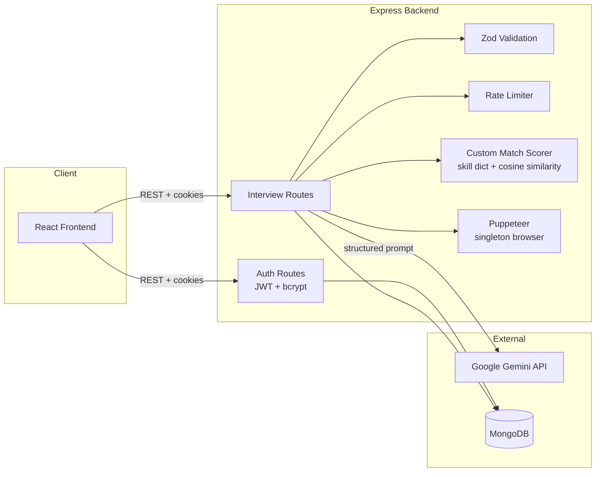

# Prepora

**AI-powered interview preparation platform.** Upload a resume and a job description, and Prepora generates a tailored interview report — match scoring, technical/behavioral questions, skill-gap analysis with learning resources, a day-wise preparation roadmap, and a mock interview mode with AI feedback on your practice answers.

---

## Table of Contents

- [Features](#features)
- [Tech Stack](#tech-stack)
- [Architecture](#architecture)
- [Design Decisions](#design-decisions--why-things-are-built-this-way)
- [Getting Started](#getting-started)
- [Environment Variables](#environment-variables)
- [Testing](#testing)
- [API Overview](#api-overview)
- [Project Structure](#project-structure)

---

## Features

- **Resume ↔ Job Description analysis** — upload a PDF/DOCX resume (or write a self-description) alongside a job description to get:
  - An AI-generated match score, technical & behavioral interview questions, skill-gap analysis, and a day-wise preparation plan
  - A **second, independent match score** computed locally (no AI call) using skill-dictionary coverage + term-frequency cosine similarity — see [Design Decisions](#design-decisions--why-things-are-built-this-way)
- **Skill-gap → resource mapping** — each detected skill gap comes with a concrete suggested resource (course/article/video/practice/book)
- **Mock interview mode** — practice answering any generated question and get AI feedback (score, strengths, improvement areas)
- **Preparation roadmap with progress tracking** — checkable tasks per day, with optimistic UI updates
- **PDF export** — download a tailored resume or the full interview report as a polished PDF
- **JWT-based auth** with token blacklisting on logout

## Tech Stack

| Layer | Technology |
|---|---|
| Frontend | React (Vite), React Router, SCSS |
| Backend | Node.js, Express |
| Database | MongoDB (Mongoose) |
| AI | Google Gemini API (structured JSON output via Zod schemas) |
| PDF generation | Puppeteer (singleton browser instance, reused across requests) |
| Validation | Zod |
| Testing | Jest, Supertest |
| Rate limiting | express-rate-limit |

## Architecture



## Design Decisions — *why things are built this way*

These are the parts worth asking about — each reflects a deliberate tradeoff, not a default:

- **A locally-computed match score alongside the AI's score.** The AI's `matchScore` is a single opaque number — you can't audit *why* it landed on 75%. `matchScorer.js` computes a second, fully deterministic score using a curated skill dictionary (weighted by how often each skill is emphasized in the JD) blended with term-frequency cosine similarity between the two documents. It's transparent, auditable, and testable in complete isolation from any external API — see `tests/unit/matchScorer.test.js`.

- **Puppeteer singleton, not launch-per-request.** Launching a headless Chromium instance costs 1-3+ seconds. Every PDF-generating request used to pay that cost. Now a single browser instance is launched lazily and reused for the lifetime of the process — only a lightweight `page` is created per request.

- **Cached generated PDFs.** Both the tailored resume and the full report PDF are cached on the MongoDB document after first generation. Editing the preparation plan (e.g. checking off a task) explicitly invalidates the cached report PDF so exports stay in sync.

- **CORS is environment-aware, not just permissive.** In development, any `localhost`/`127.0.0.1` port is allowed automatically (so a changed Vite dev port never breaks things). In production, only origins explicitly listed in `CLIENT_ORIGIN` are allowed — the localhost bypass is intentionally disabled outside dev, since allowing arbitrary local origins in production would let any local page make credentialed requests using a logged-in user's cookies.

- **AI calls are timeout-wrapped and rate-limited.** A hung Gemini response no longer hangs the request indefinitely (30s timeout). AI-calling routes are separately rate-limited since each request has a real cost against API quota.

- **Validation at the boundary, not scattered through controllers.** Zod schemas + a small `validate()` middleware reject malformed requests before they reach any business logic or touch the database.

## Getting Started

### Prerequisites
- Node.js 18+
- A MongoDB connection string (local or Atlas)
- A Google Gemini API key

### Backend

```bash
cd Backend
npm install
cp .env.example .env   # then fill in your values, see below
npm run dev
```

### Frontend

```bash
cd Frontend
npm install
npm run dev
```

## Environment Variables

Create `Backend/.env` (see `Backend/.env.example`):

```dotenv
PORT=3000
MONGO_URI=your_mongodb_connection_string
JWT_SECRET=your_random_secret          # generate with: openssl rand -hex 32
GOOGLE_GENAI_API_KEY=your_gemini_key
CLIENT_ORIGIN=https://your-frontend.example.com   # comma-separate multiple if needed
```

In development (`NODE_ENV !== "production"`), any `localhost`/`127.0.0.1` origin is allowed automatically regardless of `CLIENT_ORIGIN`.

## Testing

```bash
cd Backend
npm test
```

The suite covers:
- **Unit tests** for the custom match-scoring algorithm (skill extraction, cosine similarity, blended scoring) and all Zod validation schemas — pure functions, no mocking needed
- **Integration tests** (Supertest) for auth and interview routes, with the DB layer and AI service mocked at the boundary — verifies real HTTP request/response behavior, auth middleware, validation middleware, and rate limiting without depending on a live database or external API

## API Overview

| Method | Route | Description |
|---|---|---|
| POST | `/api/auth/register` | Register a new user |
| POST | `/api/auth/login` | Log in |
| GET | `/api/auth/logout` | Log out (blacklists the token) |
| GET | `/api/auth/get-me` | Get current user |
| POST | `/api/interview/` | Generate a new interview report (resume + job description) |
| GET | `/api/interview/` | List all reports for the logged-in user |
| GET | `/api/interview/report/:id` | Get a specific report |
| GET | `/api/interview/report/:id/pdf` | Download the full report as a PDF |
| POST | `/api/interview/resume/pdf/:id` | Generate/download a tailored resume PDF |
| PATCH | `/api/interview/report/:id/plan/:day/task/:taskIndex` | Toggle a prep-plan task's completion |
| POST | `/api/interview/report/:id/mock-answer` | Submit a practice answer, get AI feedback |
| GET | `/api/interview/report/:id/mock-answer` | Get all practice attempts for a report |

All `/api/interview/*` routes require authentication (JWT cookie). AI-calling routes are rate-limited.

## Project Structure

```
Backend/
  src/
    controllers/     # request handlers
    routes/          # route + middleware wiring
    models/          # Mongoose schemas
    services/        # ai.service.js - all Gemini/Puppeteer calls
    utils/           # matchScorer.js, PDF template builder
    validators/       # Zod request schemas
    middlewares/      # auth, validation, file upload
  tests/
    unit/            # pure-function tests
    integration/      # Supertest route tests
Frontend/
  src/
    features/
      auth/
      interview/       # pages, hooks, API client, styles
```
